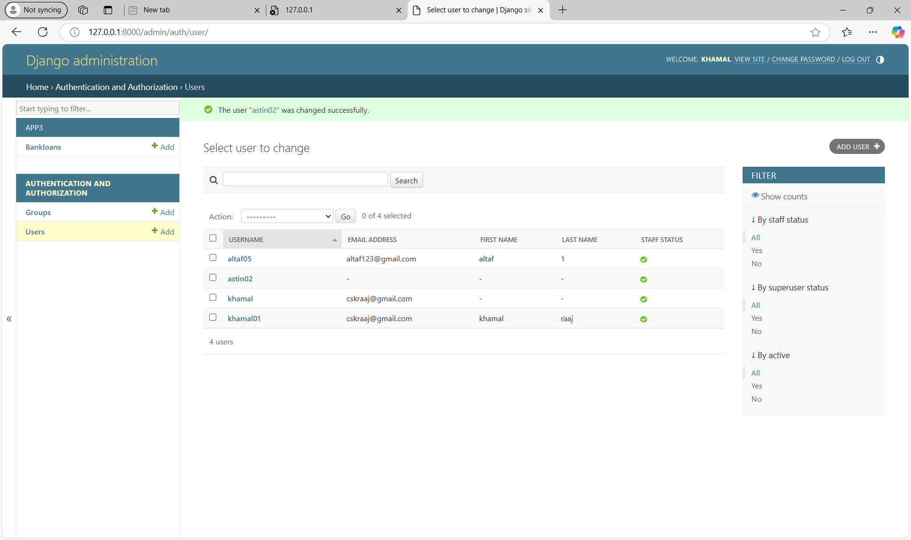

# Ex02 Django ORM Web Application
## Date: 16.11.24

## AIM
To develop a Django application to store and retrieve data from a bank loan database using Object Relational Mapping(ORM).

## ENTITY RELATIONSHIP DIAGRAM


## DESIGN STEPS

### STEP 1:
Clone the problem from GitHub

### STEP 2:
Create a new app in Django project

### STEP 3:
Enter the code for admin.py and models.py

### STEP 4:
Execute Django admin and create details for 10 books

## PROGRAM
```
admin.py 

from django.contrib import admin
from .models import Bankloan,BankloanAdmin
admin.site.register(Bankloan,BankloanAdmin)

models.py

from django.db import models
from django.contrib import admin
class Bankloan (models.Model):
    loan_id=models.IntegerField(primary_key=True)
    loan_type=models.CharField(max_length=100)
    loan_amt=models.IntegerField()
    cust_no=models.IntegerField()
    cust_name=models.CharField(max_length=100)
class BankloanAdmin(admin.ModelAdmin):
    list_display=('loan_id','loan_type','loan_amt','cust_no','cust_name')

```
## OUTPUT



## RESULT
Thus the program for creating a database using ORM hass been executed successfully

